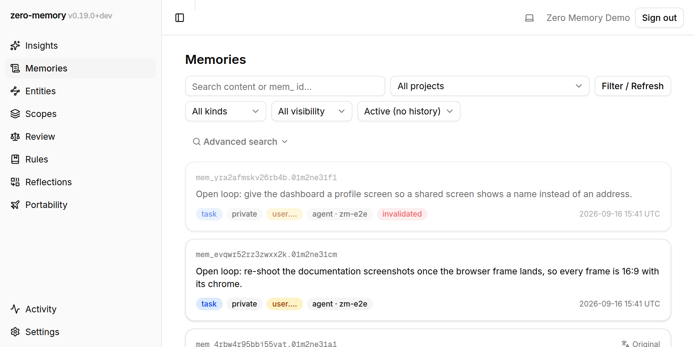
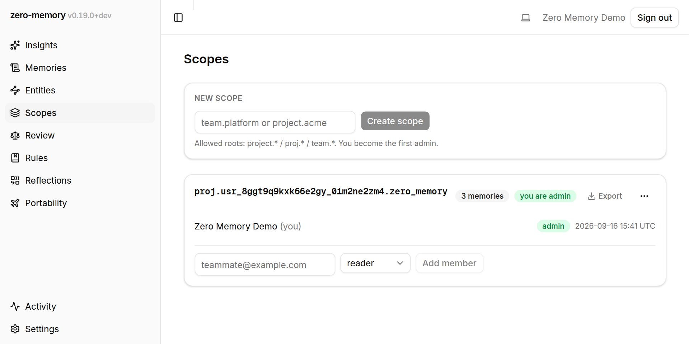
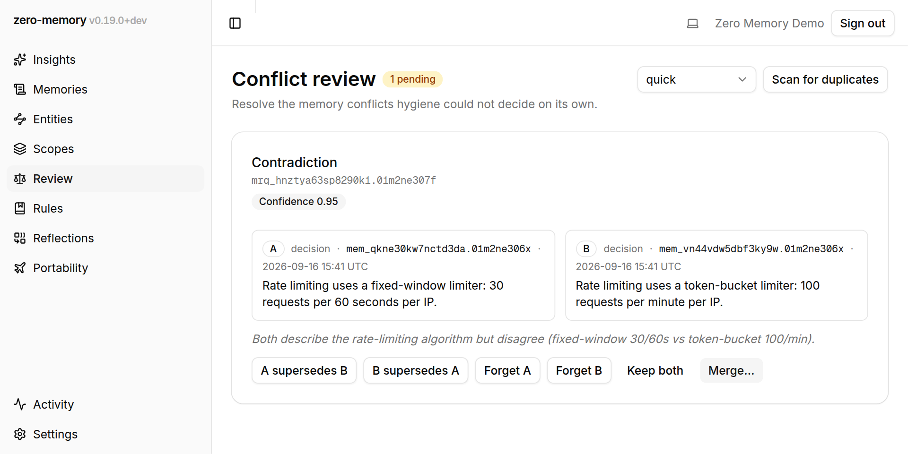
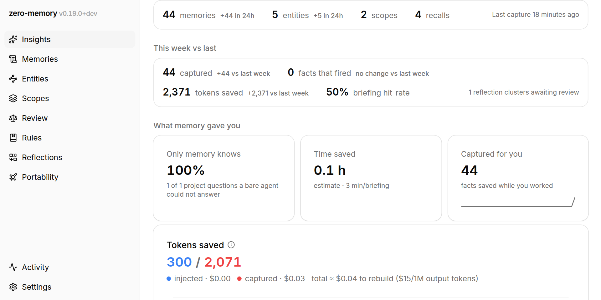

# zero-memory

Shared, persistent memory for AI coding agents. One memory server speaks MCP,
so Claude Code, Cursor, Codex CLI, VS Code, and any other MCP-compatible
client read and write the same store instead of rebuilding context from
scratch every session.

```
you ──▶ Claude Code ─┐                        ┌──────────────────────────────┐
you ──▶ Cursor ──────┼──▶ zero-memory (MCP) ──┤ pgvector + FTS, RRF-fused    │
teammate ─▶ Codex ───┘      write ──▶         │ decisions · gotchas · rules  │
                            ◀── recall        └─ Postgres · RLS ─────────────┘
```



## The problem

Every new session starts from zero. The decision you explained yesterday, the
gotcha that cost an afternoon, the convention nobody wrote down — all of it
has to be retyped, or it is silently re-derived, usually differently.

Writing it down is the easy half. The hard half is that it has to come back
on its own, in whatever tool the next session happens to open, to whoever is
working — and only to the people it belongs to.

## What it does

It remembers decisions with their reasoning, not just facts, alongside
gotchas, conventions, preferences, and open loops that stay visible until
someone closes them.

A session gets briefed before it starts. `build_context` returns the standing
rules, the open work, and the decisions behind the code you are about to
touch; hook-capable clients inject it automatically.

Scopes stay honest. Personal, project, and team scopes are owner-namespaced,
and access comes from explicit membership, so two projects with the same name
never share anything. Row-level security enforces that in Postgres, not in
application code.

Sharing is deliberate. A fragment is private to its author until it is
shared, and it travels with its provenance: who wrote it, when, and from
which conversation. A corrected memory retires the version it replaces,
reversibly, so the store converges instead of accumulating contradictions.
Content is canonicalized into one internal language, so a memory written in
one language is retrievable from another.

The boring parts run themselves: hygiene passes, duplicate detection, decay
and reinforcement, conflict surfacing.

Core memory (recall, remember, search, scopes, briefings) runs locally and
needs no model-provider key. Model-backed extras (repository bootstrap,
hygiene judgements, translation, rule distillation, optional transcript
ingest) need a provider credential, and transcript ingest is off by default:
a fresh install reads memory and sends nothing.

Membership is granted per person, per role, and the scope id carries its
owner:



When two memories disagree and automated hygiene cannot settle it, the pair
is surfaced side by side with the judge's confidence and rationale, and the
decision stays yours:



## Quick start

**Using an instance someone already runs.** You need an account, the client
bundle for your platform, and one installer script. No Docker, no checkout:
see [Install the client](./docs/getting-started/install-client.mdx).

**Running your own instance.** Docker for the Supabase backend, a host for
the two application containers, and a TLS edge if it will be reachable beyond
a trusted network: see [Deployment](./docs/getting-started/deployment.mdx).
One invariant matters more than the rest. `ZM_PUBLIC_URL` must equal the
external URL of the MCP server, because it is the OAuth issuer embedded in
every challenge.

**Hacking on the code.** Bun ≥ 1.3.11 and Docker:

```bash
bun install
bun run dev
```

That starts the local Supabase stack, writes the `.env` files, provisions a
development user, and brings up the MCP server on `:8787`, the dashboard on
`:3100`, and the documentation site on `:3200`.

## Architecture

A single MCP server exposes memory, briefing, hygiene, rules, import/export,
and metrics tools to every client. Standing rules promoted by an owner travel
through native MCP instructions where the client can carry them, and through
`build_context` everywhere else. Supabase provides Postgres, auth, and
realtime updates, self-hosted from the compose stack in this repository or on
Supabase cloud.

Retrieval is a hybrid RAG pipeline over atomic memories rather than document
chunks: pgvector similarity and Postgres full-text search run as two legs and
are combined by reciprocal rank fusion, so an exact identifier still ranks
when semantic similarity is weak. Long memories are covered by as many
embedding windows as their length needs, because a single vector silently
truncates past the model's window. A hit comes back as an excerpt cut from
the window that matched, not the whole record. Above it sits an entity graph
stored as edge tables.

You can check whether it is actually helping: recall hit rate, what only
memory knew, and how the corpus ages are all reported from usage events.



The stack is Turborepo + TypeScript + Next.js, arranged as a DDD/hexagonal
workspace:

| Path                  | What lives there                                             |
| --------------------- | ------------------------------------------------------------ |
| `apps/server`         | the MCP server and its HTTP surface                          |
| `apps/web`            | the dashboard                                                |
| `apps/docs`           | the documentation site                                       |
| `apps/watcher`        | the client-side binary: hooks, ingest, briefings             |
| `packages/*`          | domain, contracts, persistence, retrieval, hygiene, adapters |
| `supabase/migrations` | schema and row-level-security policies                       |
| `infra/`              | development and production compose stacks                    |
| `tests/e2e`           | the Playwright suite and its isolated stack                  |

## Documentation

Full documentation lives in [`docs/`](./docs) as Markdown and is served as a
site by [`apps/docs`](./apps/docs). Start with
[the overview](./docs/index.mdx), or go straight to
[getting started](./docs/getting-started/index.mdx). Worth reading early:
[scopes and isolation](./docs/concepts/scopes-and-isolation.mdx), the model
that decides who can see what.

## Status

Pre-1.0, running in production for its own team, and used daily to build
itself. Interfaces still move: the schema evolves through forward-only
migrations, and the memory tools are stable in shape but not frozen.

## Contributing

Bug reports, deployment reports from hosts we have never touched, and client
adapters are the most useful contributions. Start with
[CONTRIBUTING.md](./CONTRIBUTING.md); contributors sign a
[CLA](./CLA.md) on their first pull request, and the
[Code of Conduct](./CODE_OF_CONDUCT.md) applies everywhere.

Found a security problem? Do not open an issue. Follow
[SECURITY.md](./SECURITY.md).

## License

[Apache License 2.0](./LICENSE) — Copyright 2026 Kiwagu.
